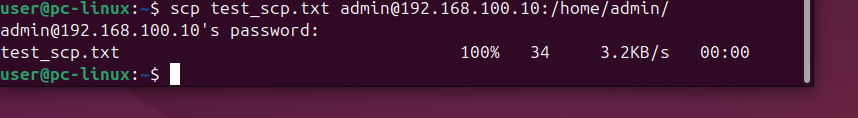

# File Transfer Test – LabSec Solutions

Tento dokument popisuje test přenosu souborů mezi Ubuntu Desktopem
a Ubuntu Serverem v interní síti LAN1.

## Použité systémy
- Ubuntu Server
- Ubuntu Desktop
- Interní síť: LAN1 (VirtualBox Internal Network)

---

## Test přenosu souboru pomocí SCP

Cílem je ověřit, že soubory lze bezpečně a spolehlivě přenášet
z Desktopu na Server pomocí SCP.

### Použitý příkaz (Desktop)
```bash
scp soubor.txt admin@192.168.100.10:/home/admin/
```
## Výsledek
Soubor byl úspěšně přenesen na server

Ověřen obsah souboru po přenosu

Přenos je šifrovaný přes SSH

## Důkaz


## Závěr
Přenos souborů mezi virtuálními stroji funguje správně.
