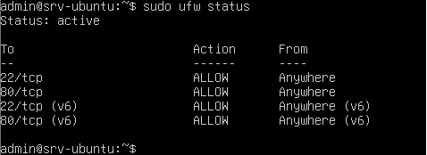

# Firewall Status – LabSec Solutions

Tento dokument popisuje kontrolu stavu firewallu na Ubuntu Serveru
v testovacím lab prostředí.

## Použité systémy
- Ubuntu Server
- Ubuntu Desktop
- Interní síť: LAN1 (VirtualBox Internal Network)

---

## Test stavu firewallu (UFW)

Cílem je ověřit, že firewall je aktivní a správně nakonfigurovaný,
povoluje SSH a blokuje nepovolené služby.

### Použitý příkaz (Server)
```bash
sudo ufw status
```
## Výsledek
Firewall je aktivní (Status: active)

Povoleno připojení přes SSH

Ostatní porty jsou blokovány, podle konfigurace

## Důkaz


## Závěr
Firewall na serveru je funkční a poskytuje základní ochranu
síťového prostředí labu.
