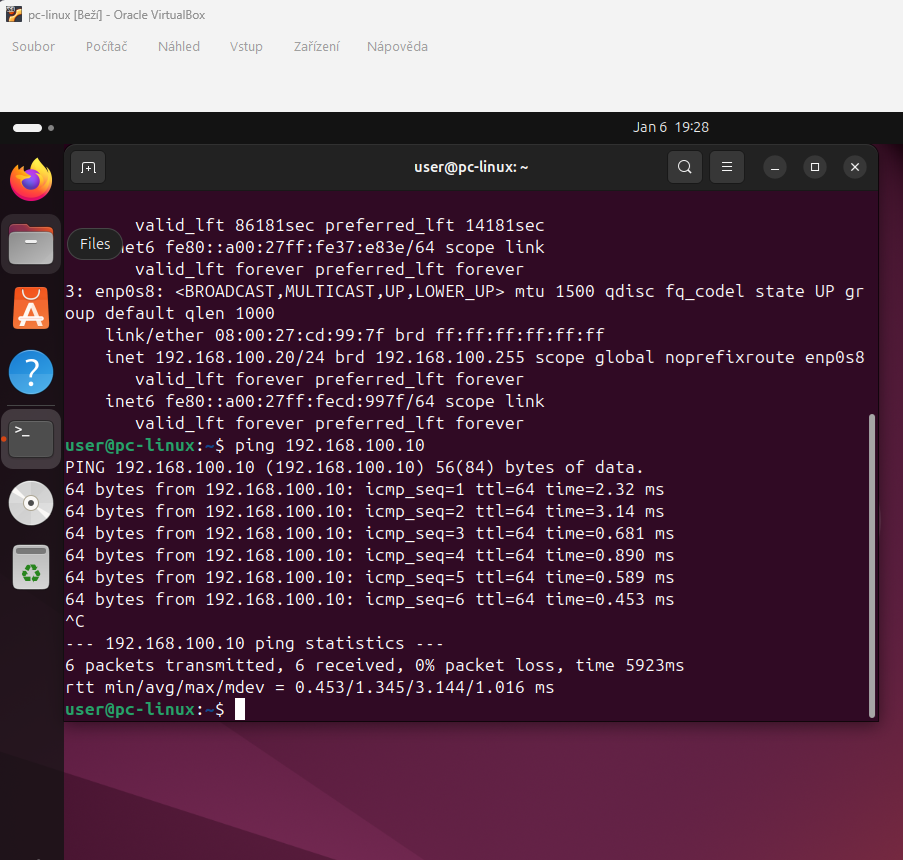

# Network Setup – LabSec Solutions

Tento dokument popisuje základní síťovou konfiguraci testovacího
lab prostředí a ověření konektivity mezi virtuálními stroji.

## Použité systémy
- Ubuntu Server
- Ubuntu Desktop
- Interní síť: LAN1 (VirtualBox Internal Network)

---

## Ověření síťové konektivity (Ping)

Cílem testu je ověřit, že Ubuntu Desktop a Ubuntu Server spolu
komunikují v interní síti LAN1.

### Použitý příkaz (Ubuntu Desktop)
```bash
ping 192.168.100.10
```
## Výsledek
Ping byl úspěšný. Bylo potvrzeno:

funkční interní síť LAN1

správné nastavení IP adres

neblokovaný ICMP provoz

## Důkaz



## Závěr
Základní síťová konektivita mezi virtuálními stroji v lab prostředí
je funkční.
