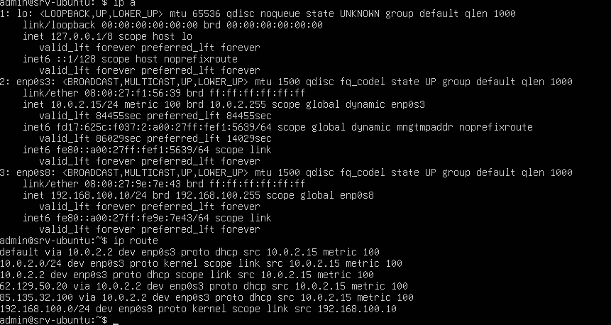

# Network Diagnostics – LabSec Solutions

Tento dokument popisuje základní diagnostiku sítě v testovacím
lab prostředí mezi Ubuntu Server a Ubuntu Desktop.

## Použité systémy
- Ubuntu Server
- Ubuntu Desktop
- Interní síť: LAN1 (VirtualBox Internal Network)

---

## Výpis IP adres a směrovací tabulky

Cílem je ověřit konfiguraci síťových adaptérů a směrovací tabulky
na Ubuntu Serveru.

### Použité příkazy

```bash
ip a
ip route
```
##Výsledek
Ověřen správný IP rozsah pro interní síť

Ověřena přítomnost loopback a interního adaptéru

Směrovací tabulka obsahuje správné cesty pro LAN1

##Důkaz


##Závěr
Konfigurace síťových adaptérů a směrovací tabulky na serveru je
správná a připravená
