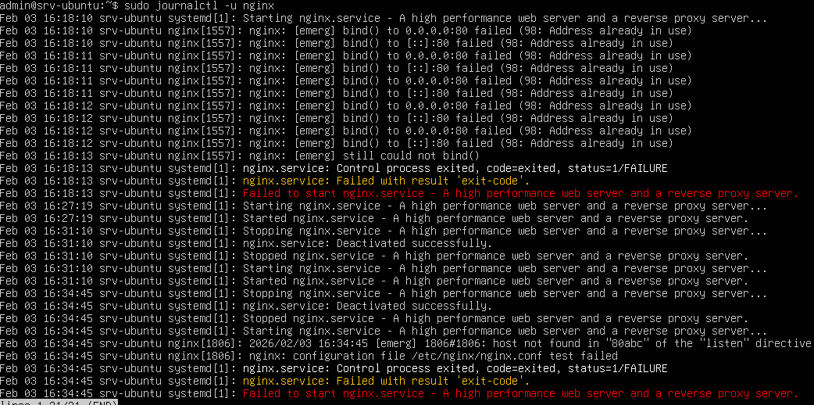
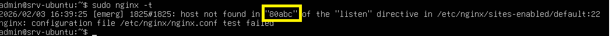
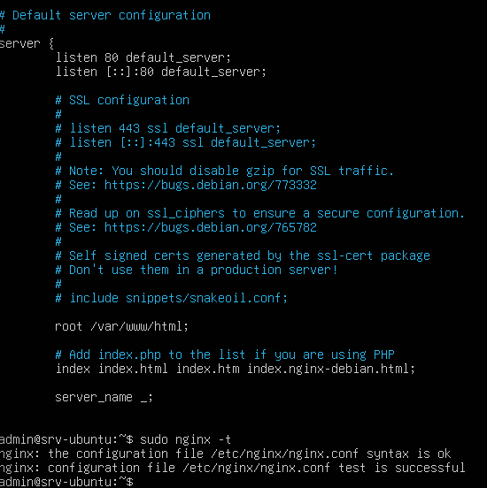

# Nginx Configuration & Service Recovery – LabSec Solutions

Tento dokument popisuje diagnostiku a opravu chybné konfigurace webového serveru Nginx, která způsobila výpadek služby, a následné obnovení provozu bez nutnosti restartu celého operačního systému.

## Použité systémy
- Ubuntu Server: Cílový uzel s běžícím Nginx (192.168.100.10)
- Interní síť: LAN1 (VirtualBox Internal Network)

---

## Popis incidentu a verifikace
Cílem bylo identifikovat příčinu selhání služby Nginx a provést nápravu tak, aby:

- byla zachována integrita konfigurace (nginx -t)

- služba byla řádně spuštěna (restart služby, nikoliv OS)

- byla ověřena syntaktická správnost před nasazením

## Diagnostika a oprava (postup)
1. Detekce chyby
Nejprve bylo nutné zjistit, proč služba neběží. K tomu slouží standardní systémové nástroje:

Bash

```Bash
sudo systemctl status nginx```

```Bash
sudo journalctl -u nginx --no-pager | tail -n 20```

2. Validace konfigurace
Příkaz pro kontrolu syntaxe odhalil konkrétní chybu v konfiguračním souboru:

```Bash
sudo nginx -t```
3. Oprava a restart služby
Po odstranění chyby v souboru (např. v /etc/nginx/nginx.conf) byla služba znovu nahrána:

```Bash
sudo systemctl restart nginx```

## Výsledek
Autentizace: Služba Nginx je nyní plně funkční a v aktivním stavu (active (running)).

Konfigurace: Výstup nginx -t potvrzuje, že syntaxe je v pořádku a konfigurační test byl úspěšný.

Dostupnost: Webová služba byla obnovena okamžitě po opravě konfiguračního souboru, čímž se eliminoval zbytečný downtime způsobený případným rebootem.

## Důkaz








## Závěr
Díky nástrojům pro kontrolu syntaxe (nginx -t) a správě služeb přes systemctl byla chyba rychle lokalizována a odstraněna. Postup demonstruje efektivní správu webového serveru s minimálním dopadem na dostupnost ostatních služeb běžících na stejném uzlu.

[← Zpět na hlavní přehled](../README.md)
