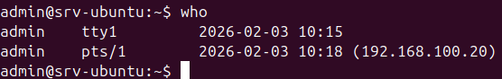

# SSH Access & Firewall – LabSec Solutions
Tento dokument popisuje ověření bezpečného přístupu pomocí SSH klíčů a kontrolu stavu firewallu na Ubuntu Serveru v testovacím lab prostředí.

## Použité systémy
- Ubuntu Server: Cílový uzel (192.168.100.10)
- Ubuntu Desktop: Administrační stanice (192.168.100.20)
- Interní síť: LAN1 (VirtualBox Internal Network)

## Verifikace přístupu a zabezpečení
Cílem je prokázat, že server:
- vyžaduje autentizaci pomocí SSH klíče (bez použití hesla)
- filtruje síťový provoz pomocí firewallu UFW

## Použité příkazy (spuštěno z Desktopu)
Bash
# Přihlášení na server (proběhne automaticky díky SSH klíči)
```ssh admin@192.168.100.10```

```sudo ufw status```

```who```
## Výsledek
Autentizace: Přihlášení proběhlo úspěšně bez výzvy k zadání hesla (použit Ed25519 klíč).

Firewall: UFW je aktivní (Status: active) a povoluje pouze nezbytný provoz na portu 22 (SSH).

Relace: Příkaz who potvrzuje, že uživatel admin je připojen z autorizované IP adresy administrační stanice (Ubuntu Desktop).

## Důkaz




## Závěr
Implementace SSH klíčové autentizace ve spojení s firewallem UFW minimalizuje riziko neautorizovaného přístupu.
Server je nakonfigurován podle principu nejnižších privilegií (Least Privilege) na úrovni síťového přístupu.

[← Zpět na hlavní přehled](../README.md)
