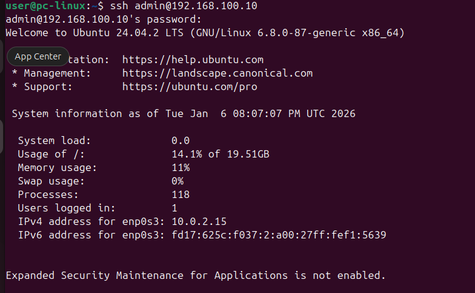
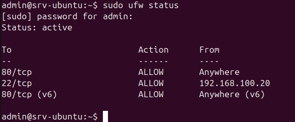

# SSH Access Test – LabSec Solutions

Tento dokument popisuje test vzdáleného přístupu přes SSH
v testovacím lab prostředí.

## Použité systémy
- Ubuntu Server
- Ubuntu Desktop
- Interní síť: LAN1 (VirtualBox Internal Network)

---

## Test SSH přihlášení

Cílem je ověřit funkční vzdálené přihlášení z Ubuntu Desktopu
na Ubuntu Server pomocí SSH.

### Použitý příkaz (Desktop)
```bash
ssh admin@192.168.100.10
```
## Výsledek
Přihlášení bylo úspěšné

Autentizace proběhla přes uživatele

SSH spojení je stabilní a připravené pro další přenosy souborů

## Důkaz



## Závěr
SSH přístup mezi virtuálními stroji funguje správně.

[← Zpět na hlavní přehled](../README.md)
