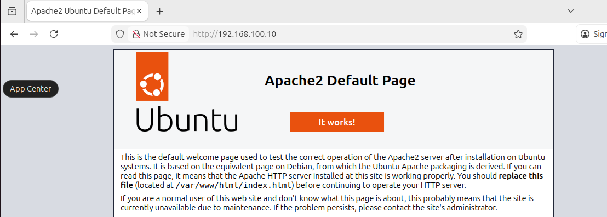

# Web Server Test – LabSec Solutions

Tento dokument popisuje test běžícího webového serveru
v interní síti LAN1 v testovacím lab prostředí.

## Použité systémy
- Ubuntu Server (Apache2)
- Ubuntu Desktop
- Interní síť: LAN1 (VirtualBox Internal Network)

---

## Test přístupu k webovému serveru

Cílem je ověřit, že webový server je dostupný z Ubuntu Desktopu
a správně poskytuje obsah přes HTTP.

### Použitý příkaz / prohlížeč
Na Desktopu otevřeno:
http://192.168.100.10

## Výsledek
- Stránka byla načtena úspěšně
- HTTP požadavky byly doručeny serveru
- Apache běží a odpovídá na požadavky z interní sítě

## Důkaz

---

## Závěr
Webový server je funkční a dostupný z interní sítě LAN1.
Lab prostředí je připraveno pro další testy síťových služeb.
