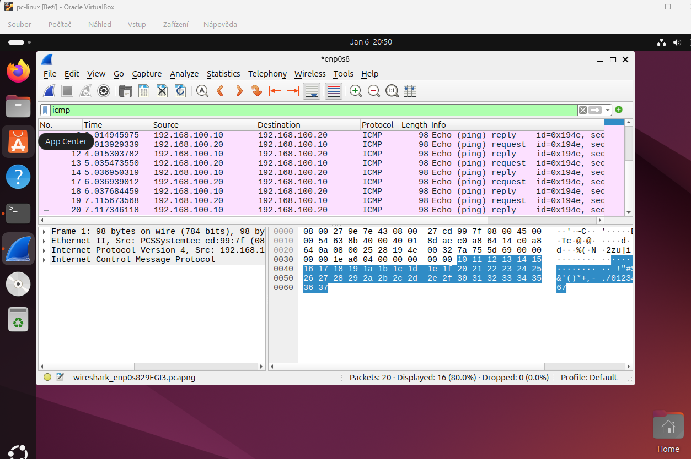

# Wireshark Capture – LabSec Solutions

Tento dokument popisuje základní zachycení síťového provozu
v testovacím lab prostředí mezi Ubuntu Desktopem a Ubuntu Serverem.

## Použité systémy
- Ubuntu Server
- Ubuntu Desktop
- Interní síť: LAN1 (VirtualBox Internal Network)
- Wireshark (Desktop)

---

## Zachycení ICMP provozu

Cílem je ověřit, že ICMP echo request a echo reply funguje
v interní síti LAN1 a že lze vizualizovat pakety pomocí Wireshark.

### Použitý příkaz / filtr
- Spuštěno zachytávání na Desktopu
- Filtr Wireshark: `icmp`

## Výsledek
- ICMP echo request byly odeslány z Desktopu
- ICMP echo reply byly přijaty ze Serveru
- Komunikace potvrzuje funkční interní síť a průchod ICMP provozu

## Důkaz

---

## Závěr
Wireshark potvrzuje správnou funkci interní sítě LAN1 a průchod
ICMP paketů mezi Desktopem a Serverem.
Lab prostředí je připraveno pro další analýzu síťového provozu.

[← Zpět na hlavní přehled](../README.md)
